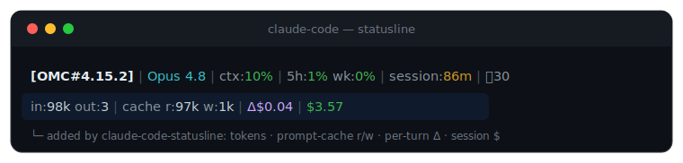

<h1 align="center">claude-code-statusline</h1>

<p align="center">
  A Claude Code statusline that shows what your session actually costs —
  <br>token in/out, prompt-cache read/write, per-turn spend, and running session total.
</p>

<p align="center">
  
</p>

<p align="center">
  
  
  
</p>

---

## Why

Claude Code's built-in statusline (and the OMC HUD, on consumer plans) doesn't show
the two numbers that actually tell you whether a session is running efficiently:

- **prompt-cache read vs write** — a healthy turn reads a lot from cache and writes almost nothing. A sudden **write** spike means something changed the stable prompt prefix and *invalidated the cache*, so you're paying full price again. It's a money warning light.
- **per-turn cost (Δ)** — how much the *last* turn cost, next to the cumulative session total.

This repo installs a statusline that surfaces all of it, in one line, in two flavors.

## Preview

```
[OMC#4.15.2] | Opus 4.8 | ctx:10% | 5h:1% wk:0% | session:86m | 🔧30
in:98k out:3 | cache r:97k w:1k | Δ$0.04 | $3.57
     ↑            ↑                  ↑        ↑
  turn in/out   cache read/write   this turn  session total
```

The top line is your existing HUD; the second line is what this repo adds.

## Install

```sh
curl -fsSL https://raw.githubusercontent.com/byungwook-min/claude-code-statusline/main/install.sh | bash
```

Or from a clone:

```sh
git clone https://github.com/byungwook-min/claude-code-statusline.git
cd claude-code-statusline
./install.sh
```

Then open a new Claude Code session. Requires **`jq`** (and `bc` for the standalone flavor's millions formatting).

The installer is **idempotent** and **backs up `settings.json`** before every change.

## Two flavors (auto-detected)

| | **omc** | **standalone** |
|---|---|---|
| When | You run [oh-my-claudecode](https://github.com/Yeachan-Heo/oh-my-claudecode) | Plain Claude Code, no OMC |
| What installs | `omc-hud-plus.sh` — a thin wrapper that keeps the OMC HUD **untouched** and appends the metrics line below it | `statusline-command.sh` — a self-contained statusline (dir · git · model · in/out · cache r/w · session $ · context tokens) |
| HUD | Rendered by your OMC install (never modified) | N/A |

`install.sh` picks the flavor by checking for `~/.claude/hud/omc-hud-cache.sh`. Force it with `--omc` or `--standalone`.

## Surviving `omc update`

`omc update` (and OMC re-setup) rewrite `settings.json` and **reset `statusLine.command`**,
dropping the wrapper. Two safety nets are installed so you never have to remember:

1. **Auto-heal hook** — a `SessionStart` hook (`hooks/statusline-guard.mjs`) that re-points
   `statusLine.command` back at the wrapper whenever it detects drift. It only writes on
   drift, and never breaks a session. *(Takes effect from the next render/session.)*
2. **Re-apply skill** — `/claude-code-statusline`, a user-invocable skill that re-runs the
   installer on demand. Say "statusline 재설정" / "restore statusline".

Skip either with `install.sh --no-hook` / `--no-skill`.

## Manual install

Prefer to wire it yourself? Copy the script you want into `~/.claude/`, then merge the
matching blocks from [`settings-snippet.json`](settings-snippet.json) into
`~/.claude/settings.json` (don't overwrite the whole file):

- `statusLine` — points at the script (use the `_statusLine_standalone_variant` for standalone)
- `omcHud` — optional HUD look (OMC only)
- `hooks.SessionStart` — the auto-heal hook

## How it works

Claude Code pipes a JSON payload to the statusline command on **stdin** every render.
The scripts read these fields (verified against a live payload):

| field | shown as |
|---|---|
| `context_window.total_input_tokens` / `total_output_tokens` | `in:` / `out:` |
| `context_window.current_usage.cache_read_input_tokens` | `cache r:` (last API call only) |
| `context_window.current_usage.cache_creation_input_tokens` | `cache w:` |
| `cost.total_cost_usd` | `$` session total, and `Δ$` vs the previous render |

The **omc** flavor doesn't reimplement the HUD — it runs your real HUD launcher
(`omc-hud-cache.sh`) and appends its own line, so it survives OMC upgrades untouched.
Per-turn Δ is computed by caching the previous cumulative cost per session in
`$TMPDIR` (scratch only — safe to delete, never shared).

## Uninstall

```sh
# point the statusline back to the default (OMC users), or remove the block entirely
# then optionally delete the installed files:
rm -f ~/.claude/hud/omc-hud-plus.sh ~/.claude/statusline-command.sh \
      ~/.claude/hooks/statusline-guard.mjs
rm -rf ~/.claude/skills/claude-code-statusline
```

Restore any `settings.json.bak.*` the installer left if you want the exact prior state.

## Repo layout

```
claude-code-statusline/
├── install.sh                              # idempotent installer (curl-pipe friendly)
├── statusline/
│   ├── omc-hud-plus.sh                      # OMC wrapper (HUD + metrics line)
│   └── standalone.sh                        # self-contained statusline
├── skill/claude-code-statusline/SKILL.md   # /claude-code-statusline re-apply skill
├── hooks/statusline-guard.mjs              # SessionStart auto-heal hook
├── settings-snippet.json                   # reference settings blocks
└── assets/preview.svg                       # the image above
```

## License

MIT © [byungwook-min](https://github.com/byungwook-min)
