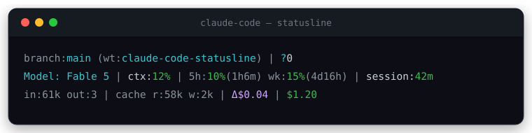

<h1 align="center">claude-code-statusline</h1>

<p align="center">
  A three-line HUD for Claude Code — git context, model / context / rate limits,
  <br>and what the session actually costs: token in/out, prompt-cache read/write and time-to-expiry, per-turn spend, running total.
</p>

<p align="center">
  
</p>

<p align="center">
  
  
  
</p>

---

## What it shows

| line | shows |
|---|---|
| 1 | git branch, worktree name, dirty-file count (30 s cache per cwd so large monorepos stay fast) |
| 2 | model, context-window %, 5-hour / weekly rate-limit usage with reset countdown, session uptime |
| 3 | tokens in/out, prompt-cache read/write, cache TTL with time left before it goes cold, per-turn cost `Δ$`, cumulative session `$` |

Every segment is **always rendered, even at zero** — `?0`, `5h:--%` and `· --(--)` before the first API response,
`Δ$0.00`, `$0.00` — so the bar keeps a fixed shape and never jumps in height or width between turns.

## Why

Claude Code's built-in statusline doesn't show the two numbers that tell you whether a
session is running efficiently:

- **prompt-cache read vs write** — a healthy turn reads a lot from cache and writes almost nothing.
  A sudden **write** spike means something changed the stable prompt prefix and *invalidated the cache*,
  so you're paying full price again. It's a money warning light.
- **per-turn cost (Δ)** — how much the *last* turn cost, next to the cumulative session total.
- **cache time-to-expiry** — `1h(52m)` while warm (yellow under 10 min), `1h(COLD +135k)` once the
  prefix has expired, where `+135k` is what the next request re-caches at the cache-write rate.
  Within the TTL every turn is a cheap cache read; the first turn after a longer break rewrites the
  whole context. A diagnosed miss shows its cause (`miss:tools_changed`) for two minutes.

`refreshInterval: 60` re-renders once a minute so the countdown keeps ticking while you're away
from the keyboard; the HUD is otherwise event-driven like any statusline.

## Install

```sh
curl -fsSL https://raw.githubusercontent.com/byungwook-min/claude-code-statusline/main/install.sh | bash
```

Or from a clone:

```sh
git clone https://github.com/byungwook-min/claude-code-statusline.git
cd claude-code-statusline
./install.sh
```

Then open a new Claude Code session. Requires **`node`** and **`jq`**.

The installer is **idempotent** and **backs up `settings.json`** before every change. It:

1. copies `statusline/hud.mjs` into `~/.claude/statusline/`
2. sets `statusLine` (`command` + `refreshInterval: 60`) in `~/.claude/settings.json`
3. adds a `SessionStart` hook (`hooks/statusline-guard.mjs`) that re-asserts the `statusLine` block
   if another tool rewrites `settings.json` — it only writes on drift and never breaks a session
4. installs `/claude-code-statusline`, a skill that re-runs the installer on demand

Skip 3 / 4 with `--no-hook` / `--no-skill`. `--print` is a dry run. `--config-dir DIR` targets another config dir.

## Manual install

Copy `statusline/` into `~/.claude/`, then merge the blocks from
[`settings-snippet.json`](settings-snippet.json) into `~/.claude/settings.json` (don't overwrite the whole file).

## How it works

Claude Code pipes a JSON payload to the statusline command on **stdin** every render.

| field | shown as |
|---|---|
| `workspace.current_dir` → `git branch --show-current`, `rev-parse --show-toplevel`, `status --porcelain` | `branch:` / `(wt:)` / `?N` |
| `model.display_name` | `Model:` |
| `context_window.used_percentage` | `ctx:N%` (green < 50, yellow < 80, red) |
| `rate_limits.five_hour` / `seven_day` (`used_percentage`, `resets_at`) | `5h:N%(reset)` `wk:N%(reset)` |
| first-seen timestamp per `session_id` (in `$TMPDIR`) | `session:Nm` |
| `context_window.total_input_tokens` / `total_output_tokens` | `in:` / `out:` |
| `context_window.current_usage.cache_read_input_tokens` / `cache_creation_input_tokens` | `cache r:` / `w:` |
| `prompt_cache.ttl`, `warm`, `expires_at`, `recache_tokens_if_cold`, `last_miss_at`, `last_miss_cause` | `· 1h(52m)` / `· 1h(COLD +135k)` / `miss:<cause>` |
| `cost.total_cost_usd` diffed against the previous render (per session, in `$TMPDIR`) | `Δ$` |
| `cost.total_cost_usd` | `$` |

Design constraints: the HUD **never throws** (a crash leaves a blank bar — every optional section is guarded)
and **never blocks** (git calls carry a 1 s timeout; everything else is read from the stdin payload). Requires Claude Code ≥ 2.1.251
for the `rate_limits` / `prompt_cache` fields; older versions simply show `--` there.

## Uninstall

```sh
rm -f ~/.claude/statusline/hud.mjs ~/.claude/hooks/statusline-guard.mjs
rm -f ~/.claude/skills/claude-code-statusline/SKILL.md
```

Then remove the `statusLine` block and the `statusline-guard.mjs` entry under `hooks.SessionStart`
from `~/.claude/settings.json` (or restore a `settings.json.bak.*` the installer left).

## Repo layout

```
claude-code-statusline/
├── install.sh                              # idempotent installer (curl-pipe friendly)
├── statusline/hud.mjs                      # the 3-line HUD renderer
├── hooks/statusline-guard.mjs              # SessionStart auto-heal hook
├── test/                                   # node --test: HUD states + guard healing
├── skill/claude-code-statusline/SKILL.md   # /claude-code-statusline re-apply skill
├── settings-snippet.json                   # reference settings blocks
└── assets/make-preview.py                  # regenerates assets/preview.svg from real HUD output
```

## License

MIT © [byungwook-min](https://github.com/byungwook-min)
